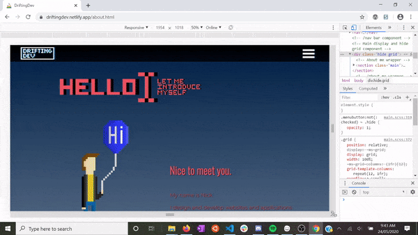

# Drifting Dev Portfolio Website
## Nick Ducker

## [Github Repo](https://github.com/nick-ducker/portfolio-1)

## [Drifting Dev Portfolio](https://driftingdev.netlify.app)

***

## Purpose

This website is intended to serve as a portfolio for my development brand "Drifting Dev". It is a showcase of my work as a developer and graphic designer. I hoped to give the viewer a good understanding of my personality and style as a developer without being over-reliant on text, instead using graphical content, design and UX elements to communicate. 

This site contains a stripped back about me page with links to a resume and a skills graph. A projects page that showcases and links some of my github repos. A blog page that contains five standalone blogs and a contact page with twitter, github, linked in and email links. 

The target audience for this website is any potential employer or any other coders looking to collaborate.

## Functionality / Features 
  * **Stripped back page design:**
      
      I tried to create a site that only has a few, attention grabbing elements per page for the viewer to interact with. I didnt want to have a sidebar, footer and header detracting from the main content on each page itself. To this end, I've used a simple black header at holds the main logo and a hamburger menu dropdown element. 

      Each page itself has relatively centralized content that sits in their respective sections. I wanted the user to be able to focus on one thing at a time, rather than having several blocks of content competing for attention on the same amount of screen space.

      
      _The first "block" of content on the about me page_

      
      _The second "block" of content on the about me page_

  * **Dedicated dropdown menu for site navigation**

      I used a dedicated drop down menu to again help simplify the UX of the website. When the user presses the menu icon, a menu will drop down and hide whatever content is on the page and display 4 icons with names. Clicking the menu button again will smoothly transition back to the page.

      

  ***

  * **Responsiveness for mobile, tablet and desktop size screens**

    The site has been created with responsiveness in mind from the ground up. The site was built for mobile first, then optimized for tablet and desktop screens once the mobile site was complete.

    

  * **Expandable content elements**

    Both the blog page and project page contain expandable elements that react to hover and touch on desktop and tablet/mobile respectively. The goal was again to create an easy to navigate page structure that wouldn't clutter the screen too much. The user is able to nagivate to a view only the content they're potentially interesting in this way. 

    

    _Blog page expandable elements_

    

    _Project page exandable elements_

  ***

  * **Animated graphical content throughout website**

  While the website itself is fairly stripped back, I wanted to include a few subtle animations to keep the user engaged. To this end, the title page, about page, contact page and menu all have subtle animation elements to them. 

  

  

  

  

  ***

  * **Custom pixel art created specifically for brand and site**

  All the pixel art on this site, including banners and icons was custom made for the purpose. While this is potentially a little overkill, I wanted to make sure my site stood out from the pack in as many ways as I could. Creating some relatively simple pixel art elements seemed like a good way to do this.

  * ****

## Sitemap

The site is simple to navigate. From any page you are able to access the full menu to bring you to any page. At any point the user can click on the drifting dev logo to be taken back to the title page. There is a link out to a resume PDF on the about me page, links out to social media accounts and email on the contact page and links out to a projects respective github repo on the projects page.

## Tech Stack

* HTML5
* SCSS